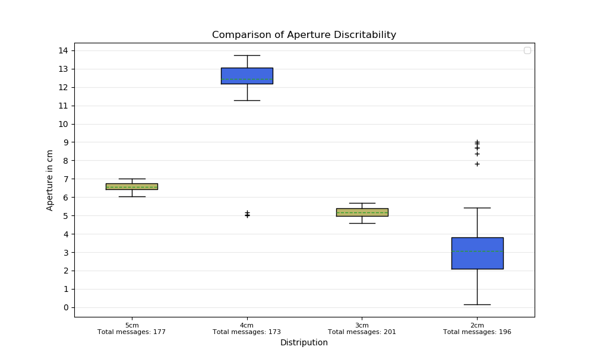

# From raw visual data to 3D positional data

In a __new terminal__ launch [openpose_utils](https://github.com/Roboskel-Manipulation/openpose_utils):

        roslaunch openpose_utils_launch whole_pipeline_xtion_with_marker.launch

In a __new terminal__ launch [bag_read_server](https://github.com/ThanasisTs/bag_read_service):
        
        roslaunch bag_read_service bag_read_service.launch bag_file:="filename"

In a __new terminal__ launch [frame_transpose](https://github.com/ThanasisTs/frame_transpose):

        roslaunch frame_transpose frame_transpose.launch

To record the transformed keypoints, in a __new terminal__ run:

        rosbag record -O ~/keypoints_tf.bag /transformed_points

To read the first message from the rosbag file and start the pipeline, in a __new terminal__ run:

        rosservice call /next_msg

# From rosbag to .csv

If you want to convert a rosbag to a .csv file you can use the [rosbag_pandas](https://github.com/eurogroep/rosbag_pandas) library.

Example:
        
        python bag_csv -b ~/keypoints_tf.bag -o ~/keypoints_tf.csv

<!--Finally we run the `plot_keypoints.py` file with the "plotkeypoints" argument and the name of the csv file as argument to obtain the plot of the 3d points.

        <!--python plot/plot_keypoints.py plotkeypoints ~/keypoints_tf.csv 

<!--

<!--# Boxplots of Keypoint Apertures

<!--There is also a Boxplot option for the apertire between finger tips using the argument "boxplot" with `plot_keypoints.py`

    <!--    python plot/plot_keypoints.py boxplot ~/keypoints_aperture1_tf.csv ~/keypoints_aperture2_tf.csv 

<!-- -->
