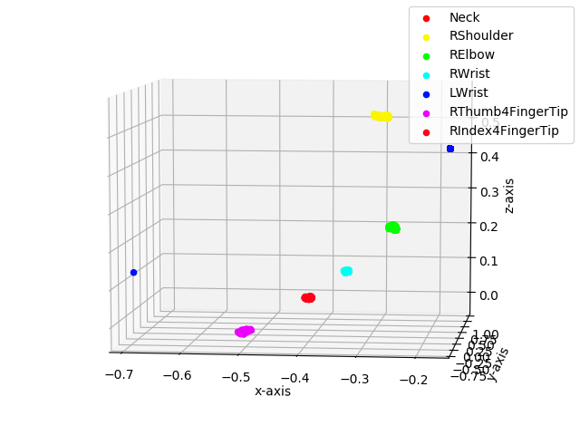

# Get 3D keypoints in base_link

First we need to create a rosbag file contaning the 3d Keypoints.
We set the pipeline and before calling the first service in a __new terminal__ we run:

        rosbag record -O keypoints.bag /keypoint_3d_matching

In a __new terminal__ we start the [static tf publisher](https://wiki.ros.org/tf#static_transform_publisher)

        roslaunch bag_read_service publish_tf.launch 
this launch file always publishes a fixed transformation from `/camera_rgb_optical_frame` to `/base_link` frame.

##### Important:
Make sure the `keypoint_codes` in `frame_transpose.yaml` are identical with the `points_of_interest` in `keypoint_3d_matching.yaml` file.

In a __new terminal__ we start the [frame_transpose](https://github.com/ThanasisTs/frame_transpose) node.

        roslaunch frame_transpose frame_transpose.launch 
This node takes messages published on /keypoint_3d_matching topic and transforms them to the `/base_link` frame. The transformed messages are being published on `/topic_transform`

In a __new terminal__ we run:

        rosbag record -O ~/keypoints_tf.bag /topic_transform
to record the transformed keypoints.

Finally, in a __new terminal__ we play the rosbag containing the 3D keypoints:

        rosbag play keypoints.bag

# Plot 3D Keypoints

When the keypoints.bag is ready we convert it into a csv file using the [rosbag_pandas](https://github.com/eurogroep/rosbag_pandas) library.

        python bag_csv -b ~/keypoints_tf.bag -o ~/keypoints_tf.csv

Finally we run the `plot_keypoints.py` file with the name of the csv file as argument to obtain the plot of the 3d points.

        python src/plot_keypoints.py ~/keypoints_tf.csv 

