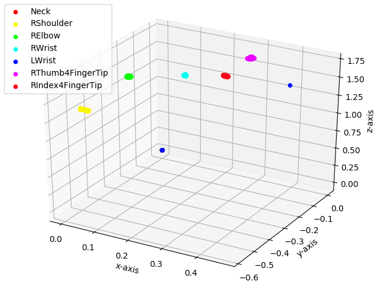

#Plot 3d Keypoints

First we need to create a rosbag file contaning the 3d Keypoints.
We set the pipeline and before calling the first service in a __new terminal__ we run:

        rosbag record -O keypoints.bag /keypoint_3d_matching

When the keypoints.bag is ready we convert it into a csv file using the [rosbag_pandas](https://github.com/eurogroep/rosbag_pandas) library.

        python bag_csv -b ~/keypoints.bag -o ~/keypoints.csv

Finally we run the `plot_keypoints.py` file with the name of the csv file as argument to obtain the plot of the 3d points.

        python src/plot_keypoints.py ~/keypoints.csv 

